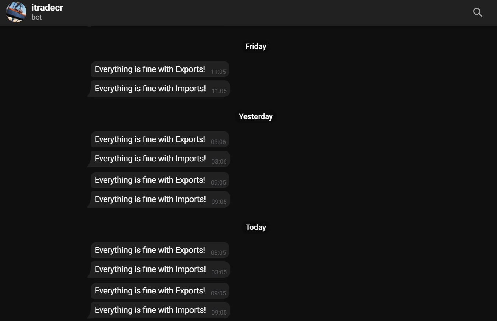

# tradecr 

Los datos del comercio internacional de Costa Rica son generados por dos instituciones:
La Promotora de Comercio Exterior de Costa Rica (PROCOMER) para exportaciones y Banco Central de Costa Rica (BCCR) para importaciones.

Estos datos se actualizan de manera periódica, sin embargo, los cambios no son fácilmente detectables. 

Tradecr es un repositorio de las estadísticas de ambos flujos, en forma de agregados por año y en Manual de Balanza VI.
Para esto, hace web scraping en el portal estadístico de [PROCOMER](sistemas.procomer.go.cr/estadisticas/inicio.aspx/). Además usa la [API](https://gee.bccr.fi.cr/Indicadores/Suscripciones/WS/wsindicadoreseconomicos.asmx)
del BCCR, para extraer los datos.

La verificación se hace mediante una integración continua en Git actions, dos veces al día (9 a. m. y 3 p. m.). A su vez, se envía una notificación de algún cambio por medio del bot itradecr en Telegram.

